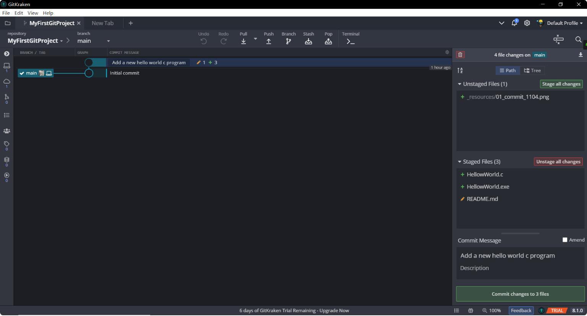
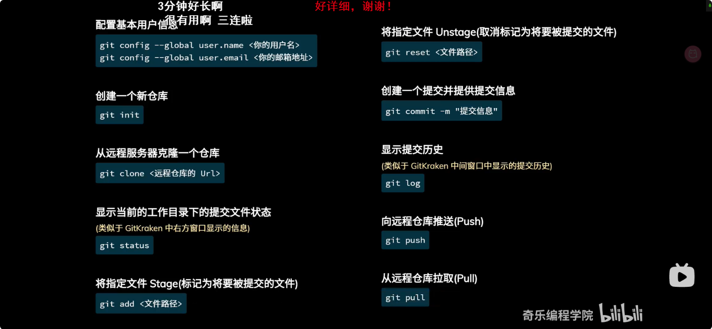

# MyFirstGitProject

这是我的第一个 git 测试文件，使用 GitKraKen 创建，后期用于测试文件

## 01.Hello World

一个 C语言 HelloWord.c

### 1.1 提交代码更改 commit changes

保存更改 `Stage Files` -> 填写描述  `Commit Message` -> 提交更改 `Commit`



<center style="color:#C0C0C0;text-decoration:underline">图1. commit 提交操作</center>

tips: 高亮可能不可用，图片文件路径应该为 ./ 相对路径

### 1.2 上传代码 pull

仅仅使用 `Commit` 在 github 上是看不到修改的，需要使用 `pull` 操作。


<center style="color:#C0C0C0;text-decoration:underline">图2. 提交分支</center>

如图所示 `master + 电脑` 为本地提交，`master + 人像` 为其他人提交，每一个master 标签为一个分支 `branch` 。

当有交叉分支可以使用 `pull` 合并分支并提交，若是冲突分支可以点击文件，进行修改。

### 1.3 $ git $ 命令行指令



<center style="color:#C0C0C0;text-decoration:underline">图3. git 常用命令一览</center>

```shell
# 配置用户基本信息
git config --global user.name <你的用户名>
git config --global user.email <你的邮箱地址> 
# 创建一个新仓库 
git init
# 从远程服务器克隆一个仓库 
git clone <远程仓库的 Url>
# 显示当前的工作目录下的提交文件状态
# (类似于 GitKraken 中右方窗口显示的信息)
git status 
# 将指定文件 Stage(标记为将要被提交的文件) 
git add <文件路径> 

# 将指定文件 Unstage(取消标记为将要被提交的文件)
git reset <文件路径> 
# 创建一个提交并提供提交信息 
git commit -m"提交信息" 
# 显示提交历史 
# (类似于 GitKraken 中间窗口中显示的提交历史)
git log
# 向远程仓库推送(Push)
git push 
# 从远程仓库拉取(Pull) 
git pull 
```

